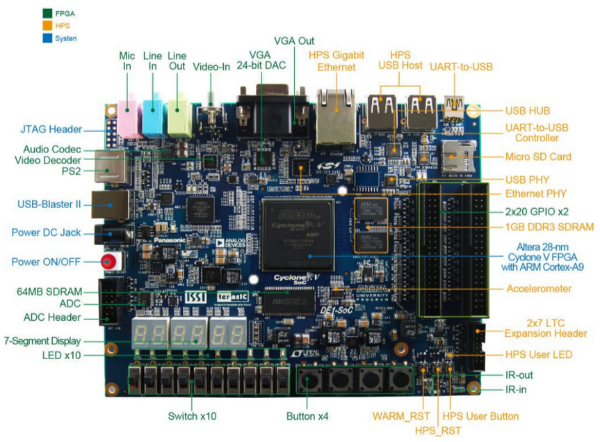

# Tetris - Sistemas Digitais (TP01)

  

<strong>Kit de desenvolvimento DE1-SoC</strong>

 

## Introdução:

Este relatório técnico apresenta o desenvolvimento de um jogo no estilo Tetris utilizando a plataforma de desenvolvimento DE1-SoC com arquitetura ARMv8. E para isso, foi necessário a aplicação prática dos conceitos de programação em C pra fazer o Tetris, criação de biblioteca do acelerômetro usando mapeamento de memória via I2C, controle de dispositivos de entrada (botões e chaves) e saída (interface VGA) disponíveis na placa. Ao decorrer da leitura, são descritas as decisões tomadas, resultados obtidos e lições aprendidas durante o processo.

## Fundamentação Teórica

### Kit de desenvolvimento DE1-SoC

A placa que foi usada para executar o jogo possue uma arquitetura baseada na *Altera System-on-Chip* (SoC) FPGA, que combina um Cortex-A9 dual core com cores embarcados com lógica programável. Nela vem integrado o HPS (Hard Processor System) baseado em ARM, consistindo no processador, periféricos como o acelerômetro (ADLX456) ultilizado e a interface de memória. O sistema do Hard Processor vem ligado perfeitamente à estrutura da FPGA usando um backbone interconectado de alta-bandalarga. (DE1-SoC Manual, 2019)

Ademais, o DE1-SoC possui as seguintes especificações gerais, de acordo com o FPGA Academy:

	• Main Features:

		- Intel® Cyclone V SoC FPGA
			* 85k logic-element FPGA
			* ARM Cortex A9 MPCORE
		- 1 GB DDR, 64 MB SDRAM
		- Micro SD Card

	• Basic IO:

		- 10 slide switches, 4 pushbuttons
		- 10 LEDs, six 7-segment displays

	• IO Devices:

		- Audio in/out
		- VGA Video out, S-Video in
		- Ethernet, USB, Accelerometer
		- A/D converter, PS/2
	
	Fonte: FPGA Academy

  

<strong>Layout e componentes do DE1-SoC</strong>

### G-Sensor ADXL345

Esse sensor é um acelerômetro de 3 eixos, que realiza medições de alta resolução. A saída digitalizada é formatada em 16 bits com complemento de dois e pode ser acessada via interface I2C.

Para a comunicação com o acelerômetro, informações obtidas no datasheet do ADXL345 e nas aulas de Arquitetura de Computadores foram de extrema importância. Através dessas fontes, foi descoberto que se faz necessário: 

	• Obter o banco de registradores (Register Map) para facilitar o mapeamento;
	• Abrir a pasta "/dev/mem" e mapeia a memória do I2C;
	• Inicializar o I2C, habilitando o controlador, definindo a taxa de clock e o endereço de destino do acelerômetro (0x53). Os registradores dessas informações correspondem de dentro do bloco I2C;
	• Configurar o acelerômetro para o modo de medição com sensibilidade de ±16g e frequência de 200 Hz;
	• Obter o valor ajustado do eixo X

Mais adiante, será explicado detalhadamente essas etapas.

### Bibliotecas para acesso de periféricos

Na placa, já veio disponiblizado bibliotecas que fazer a comunicação com os periféricos que são usados como os botões e o VGA. Para saber como ultiliza-los, o FPGA Academy foi essencial nessa etapa.

### Linguagem de Programação C

O jogo foi elaborado em lingagem C por ser um requisito do problema, sendo usado o GCC para a compilação.

## Metodologia 

Inicialmente, foi feito o levantamento de requisitos analisando como funcionaria o programa e após, foi analisado os arquivos de testes para a implementação dos métodos e atributos relacionados à cada classe. Nos arquivos, foram identificadas quatro classes implícitas envolvidas no sistema: Controller, Evento, Ingresso e Usuario. Em seguida, foi estruturado o diagrama de classes baseado na UML e debatido em sala, e por fim, houve-se a implementação do código baseado nos testes.

### Descrição de alto nível

#### - Acelerômetro

#### - Tetris

## Conclusão

## Bibliografia

####

